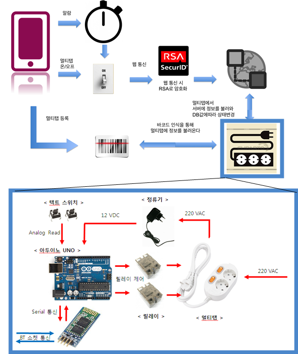

# hanium_2015

### 2015 한이음 공모대전 참가 프로젝트

### 프로젝트 개요 :  
**스마트폰을 이용한 멀티탭 전원 관리 프로그램 개발 (공모전 전시 작품 선정)**  
기존 멀티탭의 화재 발생 위험, 수동으로 스위치를 제어해야 하는 불편함, 멀티탭 방치로 인한 에너지 낭비 등의 문제를 해결하기 위해 **멀티탭 전원 관리 시스템** 구축

### 기간 : 2015.04 ~ 2015.11

### 역할 : 총 5명 중 **팀장** 역할, 프로젝트 총괄 및 개발

#### **사용 기술** :  
- H/W : `Arduino UNO R3`, `릴레이`, `이더넷 모듈`
- S/W : `Android Java`, `php`, `MySQL`  

#### **사용 툴** : `Arduino IDE`, `Android Studio`, `Sublime Text2`

#### [보고서][1]

### SCREEN SHOT
-------

[1]: document/hanium_2015.pdf
